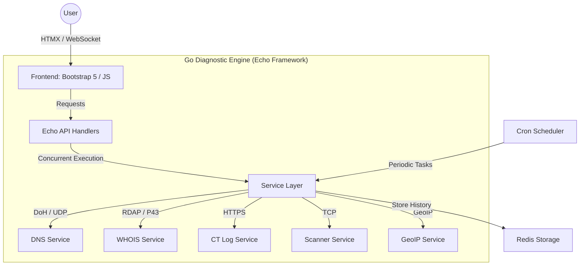

# WHOIS | Network Diagnostics & Discovery

[](https://github.com/arumes31/whois/actions/workflows/go-ci.yml)
[](https://github.com/arumes31/whois/actions/workflows/docker-publish.yml)
[](https://github.com/arumes31/whois/actions/workflows/security-scan.yml)
[](https://golang.org)
[](https://opensource.org/licenses/MIT)
[](https://github.com/arumes31/whois/issues)
[](https://github.com/arumes31/whois/commits/test)

A high-performance, professional-grade network diagnostic platform designed for deep reconnaissance and system monitoring. Featuring a modern **Copper/Brass Steampunk** aesthetic with a glassmorphism layout, it provides real-time, multi-vector analysis for IT professionals and security researchers.

## 🚀 Core Capabilities

- 🔍 **Multi-Vector LOOKUP:** Comprehensive analysis including WHOIS data, advanced DNS resolution (A, AAAA, MX, NS, TXT, SPF, DMARC), and GeoIP geolocation.
- 🌐 **Subdomain Discovery:** Uses multi-source Certificate Transparency (CT) logs (Certspotter primary, crt.sh fallback) with real-time incremental streaming.
- 🛡️ **Security Port Scanner:** Specialized tool for open port detection and service banner grabbing with localized security controls.
- 📡 **Live WebSocket Streaming:** Diagnostic results and discovery events are pushed individually as they complete, ensuring zero-latency feedback.
- 📈 **Automated Monitoring:** Periodic DNS health checks with change detection and unified diff history.
- 📦 **100% Self-Contained:** All assets (CSS, JS, Fonts) are hosted locally. Zero external CDNs required—ideal for isolated or air-gapped networks.

## 🏗️ Technical Architecture



### Technical Highlights
*   **Echo Framework:** Leverages a high-performance, minimalist Go web framework for optimized routing and middleware management.
*   **HTMX v2:** Enables a reactive, SPA-like user experience using pure HTML attributes, minimizing client-side JavaScript complexity.
*   **Concurrency:** Built on Go's goroutine model with strict `context.Context` lifecycle management for safe, parallel diagnostic execution.
*   **DNS over HTTPS (DoH):** Implements secure, encrypted DNS queries with automatic load balancing across providers (Cloudflare, Google, Quad9).

## 🛠️ Tech Stack

| Layer | Technologies |
|---|---|
| **Backend** | Go (1.24+), Echo v4, Zap Logging |
| **Frontend** | HTMX, Bootstrap 5, Tippy.js, Prism.js |
| **Storage** | Redis (with optimized `SCAN` iterators) |
| **Networking** | DoH (DNS-over-HTTPS), RDAP, ICMP, TCP |
| **DevOps** | Docker, GitHub Actions, golangci-lint |

## 📦 Installation & Setup

### Docker Compose (Recommended)
```bash
docker compose up -d
```
Access the dashboard at `http://localhost:14400`.

### Environment Configuration
| Variable | Description | Default |
|----------|-------------|---------|
| `SECRET_KEY` | Key for session encryption (Required) | - |
| `DNS_SERVERS` | List of DoH resolvers | Cloudflare, Google, Quad9 |
| `BOOTSTRAP_DNS` | DNS used to resolve DoH providers | 1.1.1.1, 9.9.9.9 |
| `CONFIG_USER` | Admin username | admin |
| `CONFIG_PASS` | Admin passcode | - |
| `MAXMIND_LICENSE_KEY` | MaxMind License Key for GeoIP | - |

## 🔄 Development Lifecycle

### Automated Workflow
This project utilizes **Conventional Commits** and automated maintenance tools:
*   **Changelog:** Automatically generated via `git-cliff` on every push to the `test` branch.
*   **Linting:** Strictly enforced `golangci-lint` standards.
*   **Testing:** High-parallelism test suite covering all core services.

```bash
# Run tests
go test -v ./...

# Run linter
go run github.com/golangci/golangci-lint/cmd/golangci-lint@v1.64.5 run
```

## ⚖️ Compliance & Security
This tool is intended for authorized network diagnostics and research. Users are responsible for complying with local regulations. The platform includes a mandatory **Security & Legal Disclosure** system to ensure users acknowledge terms of use before proceeding.

---
*Built with ❤️ using Go and HTMX.*
