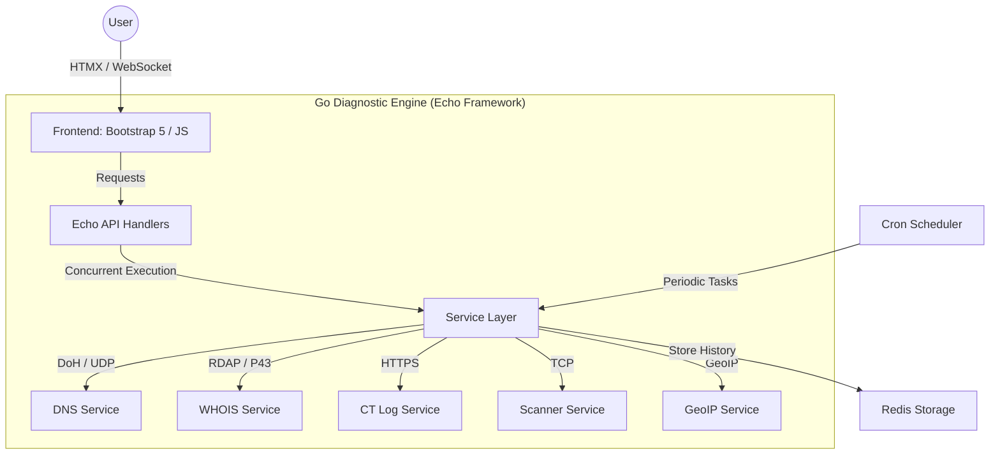

# WHOIS | Network Diagnostics & Discovery

[](https://github.com/arumes31/whois/actions/workflows/go-ci.yml)
[](https://github.com/arumes31/whois/actions/workflows/docker-publish.yml)
[](https://github.com/arumes31/whois/actions/workflows/security-scan.yml)
[](https://golang.org)
[](https://opensource.org/licenses/MIT)
[](https://github.com/arumes31/whois/issues)
[](https://github.com/arumes31/whois/commits/test)

A high-performance, professional-grade network diagnostic platform designed for deep reconnaissance and system monitoring. Featuring a modern **Copper/Brass Steampunk** aesthetic with a glassmorphism layout, it provides real-time, multi-vector analysis for IT professionals and security researchers.

## 🚀 Core Capabilities

- 🔍 **Multi-Vector LOOKUP:** Comprehensive analysis including WHOIS data, advanced DNS resolution (A, AAAA, MX, NS, TXT, SPF, DMARC), and GeoIP geolocation.
- 🌐 **Subdomain Discovery:** Uses multi-source Certificate Transparency (CT) logs (Certspotter primary, crt.sh fallback) with real-time incremental streaming.
- 🛡️ **Security Port Scanner:** Specialized tool for open port detection and service banner grabbing with localized security controls.
- 📡 **Live WebSocket Streaming:** Diagnostic results and discovery events are pushed individually as they complete, ensuring zero-latency feedback.
- 📈 **Automated Monitoring:** Periodic DNS health checks with change detection and unified diff history.
- 📦 **100% Self-Contained:** All assets (CSS, JS, Fonts) are hosted locally. Zero external CDNs required—ideal for isolated or air-gapped networks.

## 🏗️ Technical Architecture



### Technical Highlights
*   **Echo Framework:** Leverages a high-performance, minimalist Go web framework for optimized routing and middleware management.
*   **HTMX v2:** Enables a reactive, SPA-like user experience using pure HTML attributes, minimizing client-side JavaScript complexity.
*   **Concurrency:** Built on Go's goroutine model with strict `context.Context` lifecycle management for safe, parallel diagnostic execution.
*   **DNS over HTTPS (DoH):** Implements secure, encrypted DNS queries with automatic load balancing across providers (Cloudflare, Google, Quad9).

## 🛠️ Tech Stack

| Layer | Technologies |
|---|---|
| **Backend** | Go (1.24+), Echo v4, Zap Logging |
| **Frontend** | HTMX, Bootstrap 5, Tippy.js, Prism.js |
| **Storage** | Redis (with optimized `SCAN` iterators) |
| **Networking** | DoH (DNS-over-HTTPS), RDAP, ICMP, TCP |
| **DevOps** | Docker, GitHub Actions, golangci-lint |

## 📦 Installation & Setup

### Docker Compose (Recommended)
```bash
docker compose up -d
```
Access the dashboard at `http://localhost:14400`.

### Reverse Proxy Configuration (Nginx)
If you are running behind Nginx, you **must** ensure WebSocket headers are forwarded correctly:
```nginx
location / {
    proxy_pass http://localhost:14400;
    proxy_http_version 1.1;
    proxy_set_header Upgrade $http_upgrade;
    proxy_set_header Connection "upgrade";
    proxy_set_header Host $host;
    proxy_set_header X-Real-IP $remote_addr;
    proxy_set_header X-Forwarded-For $proxy_add_x_forwarded_for;
    proxy_set_header X-Forwarded-Proto $scheme;
    proxy_set_header X-Forwarded-Host $host;
}
```

### Environment Configuration

#### 🛡️ Core & Security
| Variable | Description | Default |
|----------|-------------|---------|
| `SECRET_KEY` | **Required**. Key for session encryption and CSRF protection | - |
| `SEO_ENABLED` | Enable SEO optimizations and dynamic metadata | `false` |
| `SEO_DOMAIN` | Canonical domain for SEO indexing | - |
| `ALLOWED_DOMAIN` | Base domain allowed for WebSocket connections | - |
| `WS_SKIP_ORIGIN_CHECK` | Completely disable WebSocket origin validation | `false` |
| `CONFIG_USER` | Administrator username for restricted tools | `admin` |
| `CONFIG_PASS` | Administrator passcode for restricted tools | `admin` |
| `TRUSTED_IPS` | CSV of IPs allowed to access `/metrics` | `127.0.0.1,::1,...` |
| `TRUST_PROXY` | Trust `X-Forwarded-For` headers | `true` |
| `USE_CLOUDFLARE` | Use `CF-Connecting-IP` for client identification | `false` |

#### 📡 DNS & Networking
| Variable | Description | Default |
|----------|-------------|---------|
| `DNS_SERVERS` | CSV of DoH resolvers used for multi-vector lookups | `Cloudflare, Google, Quad9` |
| `BOOTSTRAP_DNS` | DNS used to resolve the hostnames of DoH providers | `1.1.1.1, 9.9.9.9` |
| `DNS_RESOLVER` | Standard UDP resolver used for discovery modules | `8.8.8.8:53` |
| `PORT` | Local port the web server listens on | `5000` |
| `REDIS_HOST` | Hostname of the Redis server | `localhost` |
| `REDIS_PORT` | Port of the Redis server | `6379` |

#### 🔍 Diagnostic Features
| Variable | Description | Default |
|----------|-------------|---------|
| `ENABLE_GEO` | Enable GeoIP and ASN lookup features | `true` |
| `ENABLE_DNS` | Enable authoritative DNS record retrieval | `true` |
| `ENABLE_WHOIS` | Enable WHOIS and RDAP data retrieval | `true` |
| `ENABLE_SSL` | Enable SSL/TLS certificate analysis | `true` |
| `ENABLE_HTTP` | Enable HTTP security header inspection | `true` |
| `ENABLE_CT` | Enable Certificate Transparency log discovery | `true` |

#### 🌍 External API Keys
| Variable | Description | Default |
|----------|-------------|---------|
| `MAXMIND_ACCOUNT_ID` | MaxMind Account ID for GeoIP database updates | - |
| `MAXMIND_LICENSE_KEY` | MaxMind License Key for GeoIP database updates | - |

## 🔄 Development Lifecycle

### Automated Workflow
This project utilizes **Conventional Commits** and automated maintenance tools:
*   **Changelog:** Automatically generated via `git-cliff` on every push to the `test` branch.
*   **Linting:** Strictly enforced `golangci-lint` standards.
*   **Testing:** High-parallelism test suite covering all core services.

```bash
# Run tests
go test -v ./...

# Run linter
go run github.com/golangci/golangci-lint/cmd/golangci-lint@v1.64.5 run
```

## ⚖️ Compliance & Security
This tool is intended for authorized network diagnostics and research. Users are responsible for complying with local regulations. The platform includes a mandatory **Security & Legal Disclosure** system to ensure users acknowledge terms of use before proceeding.

---
*Built with ❤️ using Go and HTMX.*
