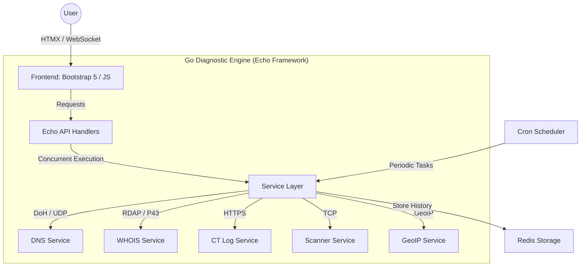

# WHOIS | Network Diagnostics & Discovery

[](https://github.com/arumes31/whois/actions/workflows/go-ci.yml)
[](https://github.com/arumes31/whois/actions/workflows/docker-publish.yml)
[](https://github.com/arumes31/whois/actions/workflows/security-scan.yml)
[](https://golang.org)
[](https://opensource.org/licenses/MIT)
[](https://github.com/arumes31/whois/issues)
[](https://github.com/arumes31/whois/commits/test)

A network diagnostic dashboard for WHOIS, DNS, HTTP/TLS inspection, GeoIP, port scanning, and monitored DNS history. It combines a Go service with a locally hosted web interface and Redis-backed state.

## 🚀 Core Capabilities

- 🔍 **Multi-Vector LOOKUP:** Comprehensive analysis including WHOIS data, advanced DNS resolution (A, AAAA, MX, NS, TXT, SPF, DMARC), and GeoIP geolocation.
- 🌐 **Subdomain Discovery:** Uses multi-source Certificate Transparency (CT) logs (Certspotter primary, crt.sh fallback) with real-time incremental streaming.
- 🛡️ **Security Port Scanner:** Specialized tool for open port detection and service banner grabbing with localized security controls.
- 🧭 **Provider-Free Target Intelligence:** Normalizes pasted URLs, detects domains/IPv4/IPv6/CIDRs/ASNs, classifies private, reserved, documentation, CGNAT, and bogon ranges, and performs reverse DNS locally.
- 🔐 **TLS & HTTP Posture:** Directly inspects certificate chains, SANs, fingerprints, supported TLS versions, OCSP stapling, redirects, request timings, cookies, CORS, security headers, and well-known policy files.
- 📡 **Live WebSocket Streaming:** Diagnostic results and discovery events are pushed individually as they complete, ensuring zero-latency feedback.
- 📈 **Automated Monitoring:** Periodic DNS health checks with change detection and unified diff history.
- 📦 **Locally Hosted UI Assets:** CSS, JavaScript, and fonts are served by the application without browser-side CDNs. Network diagnostics still contact the target and configured DNS, WHOIS/RDAP, CT, GeoIP, and database sources.

## 🏗️ Technical Architecture


```mermaid
graph TD
    User((User)) -->|HTMX / WebSocket| FE[Frontend: Bootstrap 5 / JS]
    subgraph "Go Diagnostic Engine (Echo Framework)"
        FE -->|Requests| Handler[Echo API Handlers]
        Handler -->|Concurrent Execution| Svc[Service Layer]
        Svc -->|DoH / UDP| DNS[DNS Service]
        Svc -->|RDAP / P43| WHOIS[WHOIS Service]
        Svc -->|HTTPS| CT[CT Log Service]
        Svc -->|TCP| Scan[Scanner Service]
        Svc -->|GeoIP| Geo[GeoIP Service]
    end
    Svc -->|Store History| Cache[Redis Storage]
    Scheduler[Cron Scheduler] -->|Periodic Tasks| Svc
```

### Technical Highlights
*   **Echo Framework:** Leverages a high-performance, minimalist Go web framework for optimized routing and middleware management.
*   **HTMX v2:** Enables a reactive, SPA-like user experience using pure HTML attributes, minimizing client-side JavaScript complexity.
*   **Concurrency:** Built on Go's goroutine model with strict `context.Context` lifecycle management for safe, parallel diagnostic execution.
*   **DNS over HTTPS (DoH):** Implements secure, encrypted DNS queries with automatic load balancing across providers (Cloudflare, Google, Quad9).

## 🛠️ Tech Stack

| Layer | Technologies |
|---|---|
| **Backend** | Go 1.26.4+, Echo v4, Zap Logging |
| **Frontend** | HTMX, Bootstrap 5, Tippy.js, Prism.js |
| **Storage** | Redis with bounded DNS history and set-backed dashboard counters |
| **Networking** | DoH (DNS-over-HTTPS), RDAP, ICMP, TCP |
| **DevOps** | Docker, GitHub Actions, golangci-lint |

## 📦 Installation & Setup

### Docker Compose (Recommended)

Create the local configuration first. Compose intentionally refuses to start with missing administrator credentials or a missing session-signing key.

```bash
cp .env.example .env
openssl rand -hex 32  # use this output for SECRET_KEY
openssl rand -hex 24  # use this output for CONFIG_PASS
# Edit .env and set CONFIG_USER, CONFIG_PASS, and SECRET_KEY.

docker compose config
docker compose up -d --build
```

Access the dashboard at `http://localhost:14400`.

The administrative `/login` and `/config` routes use HTTPS-only session cookies. Put the application behind an HTTPS reverse proxy before using configuration administration; plain HTTP is suitable only for the unprivileged diagnostics dashboard on a trusted local machine.

### Run the Published GHCR Image

The GHCR definition inherits the shared, hardened services from `docker-compose.yml`, so local builds and published images use identical Redis, security, feature, and concurrency settings.

```bash
cp .env.example .env
# Set CONFIG_USER, CONFIG_PASS, and SECRET_KEY in .env as shown above.
docker compose -f docker-compose.ghcr.yml config
docker compose -f docker-compose.ghcr.yml pull
docker compose -f docker-compose.ghcr.yml up -d --no-build
```

Published `latest`, release, and commit-SHA tags are built only after Go tests, the asset build, and a blocking Critical/High Trivy scan pass.

### Health and Operations

`GET /livez` reports process liveness and is used by Docker. `GET /readyz` is dependency-aware: it returns HTTP 200 when Redis is connected and HTTP 503 when Redis is unavailable. `GET /health` remains a backward-compatible readiness alias.

```bash
curl --fail http://localhost:14400/livez
curl --fail http://localhost:14400/readyz
docker compose ps
docker compose logs -f web redis
```

The `whois_data` and `redis_data` named volumes contain downloaded lookup data and application history. Back them up before upgrades that remove or recreate volumes. `docker compose down` preserves them; `docker compose down --volumes` deletes them.

### Reverse Proxy Configuration (Nginx)
If you are running behind Nginx, you **must** ensure WebSocket headers are forwarded correctly:
```nginx
location / {
    proxy_pass http://localhost:14400;
    proxy_http_version 1.1;
    proxy_set_header Upgrade $http_upgrade;
    proxy_set_header Connection "upgrade";
    proxy_set_header Host $host;
    proxy_set_header X-Real-IP $remote_addr;
    proxy_set_header X-Forwarded-For $proxy_add_x_forwarded_for;
    proxy_set_header X-Forwarded-Proto $scheme;
    proxy_set_header X-Forwarded-Host $host;
}
```

Leave `TRUST_PROXY=false` when port 14400 is reachable directly. Enable it only when clients cannot bypass the reverse proxy, and set `TRUSTED_PROXIES` to that proxy's exact IP/CIDR ranges. Forwarded client-IP headers affect access controls such as `/metrics`. Set `ALLOWED_DOMAIN` to the public hostname and keep `WS_SKIP_ORIGIN_CHECK=false`.

### Environment Configuration

#### 🛡️ Core & Security
| Variable | Description | Default |
|----------|-------------|---------|
| `SECRET_KEY` | **Required** signing key for administrator sessions; generate at least 32 random bytes | None |
| `SEO_ENABLED` | Enable SEO optimizations and dynamic metadata | `false` |
| `SEO_DOMAIN` | Canonical domain for SEO indexing | - |
| `ALLOWED_DOMAIN` | Base domain allowed for WebSocket connections | - |
| `WS_SKIP_ORIGIN_CHECK` | Completely disable WebSocket origin validation | `false` |
| `CONFIG_USER` | Administrator username; must be changed in production | `admin` outside Compose |
| `CONFIG_PASS` | Administrator passcode; minimum 12 characters in production | `admin` outside Compose |
| `ENVIRONMENT` | Runtime environment; Compose defaults to restrictive `production` behavior | `production` in Compose |
| `ALLOW_DEV_CORS` | Force-allow wildcard CORS even in non-development environment | `false` |
| `CORS_ORIGINS` | Comma-separated cross-origin clients; same-origin use needs no entry | Empty |
| `TRUSTED_IPS` | CSV of IPs allowed to access `/metrics` | `127.0.0.1,::1,...` |
| `TRUSTED_PROXIES` | CSV of proxy IP/CIDR ranges allowed to supply client-IP headers | `127.0.0.1/32,::1/128` |
| `TRUST_PROXY` | Trust `X-Forwarded-For` headers; enable only behind a trusted proxy | `false` |
| `USE_CLOUDFLARE` | Use `CF-Connecting-IP` for client identification | `false` |
| `ALLOW_PRIVATE_IPS` | Permit diagnostics against RFC1918/ULA private ranges | `false` |
| `ALLOW_LOOPBACK_IPS` | Separately permit loopback targets (development only) | `false` |
| `ALLOW_LINK_LOCAL_IPS` | Separately permit link-local targets, including metadata ranges | `false` |

#### 📡 DNS & Networking
| Variable | Description | Default |
|----------|-------------|---------|
| `DNS_SERVERS` | CSV of DoH resolvers used for multi-vector lookups | `Cloudflare, Google, Quad9` |
| `BOOTSTRAP_DNS` | DNS used to resolve the hostnames of DoH providers | `1.1.1.1, 9.9.9.9` |
| `DNS_MAX_ATTEMPTS` | Resolver attempts before returning an error; unhealthy resolvers receive a short cooldown | `3` |
| `MAX_TARGET_CONCURRENCY` | Maximum target diagnostic chains running at once | `4` |
| `MAX_SERVICE_CONCURRENCY` | Maximum individual diagnostic services running at once | `12` |
| `PORT_SCAN_CONCURRENCY` | TCP scan worker count | `32` |
| `PORT_SCAN_MAX_PORTS` | Maximum ports accepted in one scan | `1024` |
| `PORT` | Local port the web server listens on | `5000` |
| `REDIS_HOST` | Hostname of the Redis server | `localhost` |
| `REDIS_PORT` | Port of the Redis server | `6379` |

#### 🔍 Diagnostic Features
| Variable | Description | Default |
|----------|-------------|---------|
| `ENABLE_GEO` | Enable GeoIP and ASN lookup features | `true` |
| `AUTO_UPDATE_DATABASES` | Download and periodically refresh GeoIP/OUI databases; keep disabled for offline startup | `false` |
| `ENABLE_DNS` | Enable authoritative DNS record retrieval | `true` |
| `ENABLE_WHOIS` | Enable WHOIS and RDAP data retrieval | `true` |
| `ENABLE_SSL` | Enable SSL/TLS certificate analysis | `true` |
| `ENABLE_HTTP` | Enable HTTP security header inspection | `true` |
| `ENABLE_CT` | Enable Certificate Transparency log discovery | `true` |

Target classification, TLS/HTTP inspection, DNS failover, and port scanning are performed directly by the application and do not require a paid intelligence provider. GeoIP, CT, WHOIS/RDAP, and configured public DNS resolvers remain optional external data sources.

Startup is network-silent by default. For automatic GeoIP/OUI downloads set `AUTO_UPDATE_DATABASES=true`; otherwise pre-populate the persistent lookup-data volume. For a more isolated deployment, also disable unneeded external-source feature flags and point DNS settings at internal resolvers. The application is not fully offline merely because its browser assets are local.

#### 🌍 External API Keys
| Variable | Description | Default |
|----------|-------------|---------|
| `MAXMIND_ACCOUNT_ID` | MaxMind Account ID for GeoIP database updates | - |
| `MAXMIND_LICENSE_KEY` | MaxMind License Key for GeoIP database updates | - |

## 🔄 Development Lifecycle

### Automated Workflow
GitHub Actions runs pinned linting, race-enabled tests, reachable dependency vulnerability scanning, and a Docker build check. Container publication additionally builds packaged assets and scans the exact local image before assigning and pushing registry tags.

```bash
# Run the same core checks used by CI
go test -race -count=1 ./...
govulncheck ./...

# Run linter
go run github.com/golangci/golangci-lint/v2/cmd/golangci-lint@v2.11.4 run

# Validate and build the container
docker compose config
docker build --check .
```

## ⚖️ Compliance & Security
This tool is intended for authorized network diagnostics and research. Users are responsible for complying with local regulations. The platform includes a mandatory **Security & Legal Disclosure** system to ensure users acknowledge terms of use before proceeding.

---
*Built with ❤️ using Go and HTMX.*
